# PROJECT Design Documentation

## Team Information
* Team name: Team Red Wings
* Team members
  * Alex Murphy
  * Isaac Traina
  * Jason Cosmiano
  * Will Hoover

## Executive Summary

This is a summary of the project.

### Purpose
The Red Wings Jersey Store page exists to be an interactive storefront where the product owner can manage the store’s inventory while the customers can efficiently browse and make selections for purchase from the inventory.

### Glossary and Acronyms

| Term | Definition |
|------|------------|
| SPA | Single Page |
| MVP | Minimum Viable Product|
| GUI | Graphical User Interface |
| DAO | Data Access Object |
| API | Application Programming Interface |

## Requirements

This section describes the features of the application.

### Definition of MVP
In the estore, all users must be able to login, browse the inventory of jerseys, search for jerseys, view jersey details, and always see their username at the top of the screen. The owner has a unique username login. They will be able to add and remove jerseys from the inventory, and update jersey information. Customers will have access to a shopping cart. They will have the ability to add and remove jerseys from their cart. Returning customers will have access to the same shopping cart with the same jerseys from when they last logged in. When the customer is satisfied with their shopping cart, they can checkout.

### MVP Features

#### User Features
* **Login:** As a user, I want to login to the jersey store so I can have access to my personal functions.
* **Browse Jerseys:** As a user, I want to see a list of all jerseys in the estore so I can find ones that I want to look at.
* **Search for Jerseys:** As a user, I want to search for jerseys using the text in their names so I can find the exact jersey(s) that I want.
* **View Details:** As a user, I want to see a detailed description of a jersey so I can better decide if I want to edit/remove (owner) or buy it (buyer).
* **View Status:** As a User I want to see my username displayed on the UI at all times when I'm logged in so I know that I'm correctly logged in and have personal access to the estore.

#### Owner-only Features
* **Add and Remove Jerseys:** As an owner, I want to add and remove jerseys from my store so I can control what is being sold.
* **Update Jersey Information:** As an owner, I want to update the information of a jersey in the store so I can display its details correctly or add to the amount in stock.

#### Buyer-only Features
* **Add and Remove from Shopping Cart:** As a buyer, I want to add and remove jerseys in the store from my shopping cart so I can reserve and curate what I want to buy. AND as a customer I want to be able to add a jersey to my shopping cart while on the jersey details page so that I know the correct jersey is in my cart.
* **Checkout Jerseys:** As a buyer, I want to checkout my shopping cart of jerseys so I can buy and receive the jerseys I want.

### Roadmap of Enhancements

#### Planned Enhancements
The following enhancements beyond the specifications of the MVP were completed in the displayed order.
* **Logout:** As a user, I want to log out of my account so I can safely leave my device or allow someone else to login. (Implemented)
* **Low Inventory Detection:** As an owner I want to get a notification that a jersey is low in stock (only have 5 of certain jersey) so that I know what jerseys I need to stock up on. (Implemented)
* **Add/Remove Jersey Images (10% Feature):** As an owner I want to add and remove images for a specific jersey so I can improve or refine the quality and images that customers can see. (Implemented)
* **Auto-generate Jersey Images (10% Feature):** As an owner I want the estore to auto-generate a unique, basic image for a jersey that I add so I can make the store more visually appealing without having to manually add an image. (Implemented)

#### Future Enhancements
The following enhancements would have been our top considerations for implementation if the construction phase of this project were to continue.

- **Password Authentication:** As a user I want to login with a username and password rather than just a username so  only I know how to access my information and so other people can't do things with my account.
- **Database Persistence Implementation:** As a developer I want important objects and entities to be stored in a database rather than in a flat file so that the system has more storage capabilities and performs optimally.

## Application Domain

This section describes the application domain.

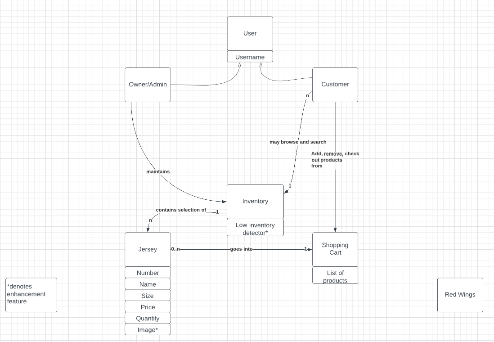

Our Store consists of Customers, who can login to the estore in order to browse and search the estore for their favorite jerseys, as well as add or remove those jerseys to their shopping cart.
The Owner is able to login to the estore in order to add and remove new jerseys to maintain the inventory.
The Inventory contains a selection of jerseys, which vary in size, price, color and player names and numbers that can be added to the shopping cart.
The shopping carts are able to save a customer's jerseys so they may log out of their account  and continue shopping at a later date.

## Architecture and Design

This section describes the application architecture.

### Summary

The following Tiers/Layers model shows a high-level view of the webapp's architecture.

The e-store web application, is built using the Model–View–ViewModel (MVVM) architecture pattern. 

The Model stores the application data objects including any functionality to provide persistance. 

The View is the client-side SPA built with Angular utilizing HTML, CSS and TypeScript. The ViewModel provides RESTful APIs to the client (View) as well as any logic required to manipulate the data objects from the Model.

Both the ViewModel and Model are built using Java and Spring Framework. Details of the components within these tiers are supplied below.

### Overview of User Interface

This section describes the web interface flow; this is how the user views and interacts
with the e-store application.

As a user, I start on the login page. If I am a customer, I enter my username to login. If I am an admin, I enter 'admin'.
  The 'login' button takes me to the next page.

The user starts on the 'Browse Products' page. This page has a navigation bar that links to both this page and my shopping cart page. The nav bar also has an option to log out, and will inform me of which user I am logged in as. Below the navigation bar, I can search for jerseys in the search bar. If there are search results matching what I enter, they will be displayed immediately after the search bar. Otherwise, nothing is displayed immediately after the search bar. Following the search jerseys section, I can view all of the products available in the store. Each jersey has a number, a name, an image showing what the jersey looks like, an indicator of low stock, and an 'add to cart' button. If I want to add a jersey to the cart then and there, I can click the 'add to cart' button. If I want to view the details of a jersey, I can either click a jersey in the search results or in the inventory page. On this page, I can view the name, number, price, size, color, stock, and image of a jersey. I can also add the jersey to my cart, return to the inventory, or use any navigation bar functionality from here. Once I have the products I want, I click on my shopping cart on the nav bar. Here, I can click the 'remove from cart' button under a jersey if I want to remove it from my cart. When I am satisfied with my cart, I press the 'checkout' button, which gives me my total price. When I am done, I click the 'Log Out' button on the nav bar, which takes me back to the login screen.

The admin starts on the 'Browse Products' page. This page has a navigation bar that links to both this page and the 'Add and Remove Products' page. The nav bar also has an option to log out, and will inform me that I am logged in as the admin. Like before, the admin can search and browse the inventory. However, when viewing the details of a jersey, I can update the name, number, price, size, color, quantity, and the image for the jersey. Name, number, price, quantity, and image have text boxes, with number and quantity featuring arrows for incrementing and decrementing by 1 at a time. Size and color have a drop-down menu so that I always choose an available color or size. If I leave the image blank or incorrect, the site will auto-generate an image of the jersey where the jersey will have the name, number, and color formatted onto it. Once I am done making changes to a jersey, I click the 'Save Changes' button, which takes me back to the browsing page. If I do not wish to save, I click the 'Back to Products' button. As the stock of jerseys decreases, the jerseys with low quantity will display an alert beneath them, reminding me to restock. The admin has a unique feature on the nav bar to 'Add/Remove Products'. Clicking that button will take me to a page with two sections. The left side allows me to create a new jersey by entering the same attributes as the page for updating a jersey. When the attributes for a new jersey are to my liking, I click the 'Add' button. On the right side of the page, I can delete jerseys by clicking the 'DELETE' button beneath a jersey I want to delete. When I am done, I click the 'Log Out' button on the nav bar, which takes me back to the login screen.

### View Tier
Components available to both customers and owner include: login, browse-page, search-component, jersey-detail, and logout. At the login page, the user is prompted to type in a username. If the typed in user name is 'admin,' then that user will have admin privileges. Anyone logging in as someone other than 'admin' will just be a customer. If the username is new, a new user is made in the shopping-carts.json file, and they have an empty shopping cart. If the user is not new, then they will have access to their shopping cart with the items they added from the previous vist. 

After logging in, the users are prompted with the browse page. This shows all the available jerseys up for sale with pictures of each jersey. If the user clicks on a jersey, they can view the jersey's detail page. It displays all attributes of the jersey (name, number, size, color, and quantity). 

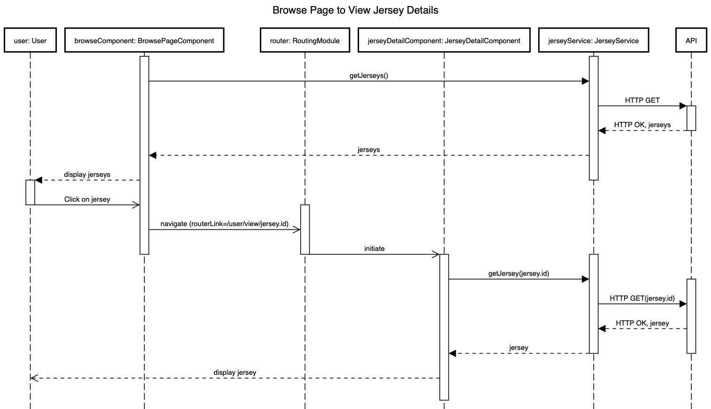

Any user can find a specific jersey by typing its name or part of its name into the search bar. The page will then display all matching jerseys, and the user may click on a displayed jersey from the search to navigate to its detail page.

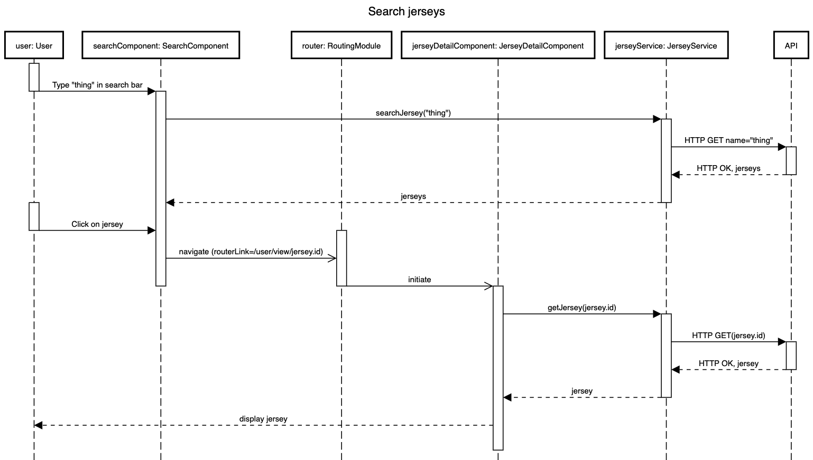

The admin can update a jersey's attributes in the jersey detail page. 

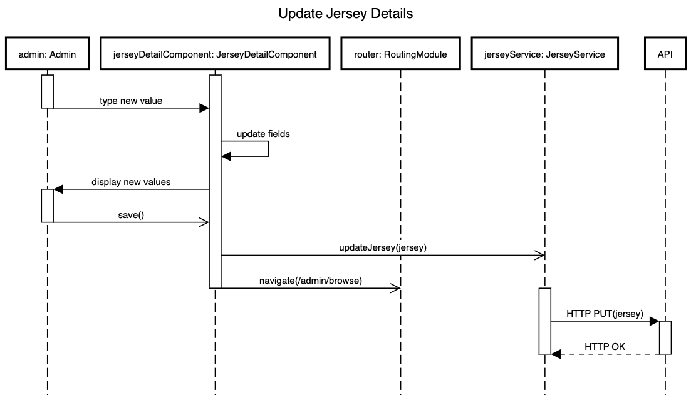

A component available to only the customer is the shopping cart. The shopping-cart component can add and remove jerseys from the cart as wanted by the user. 

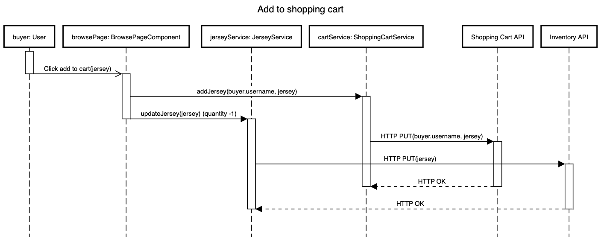
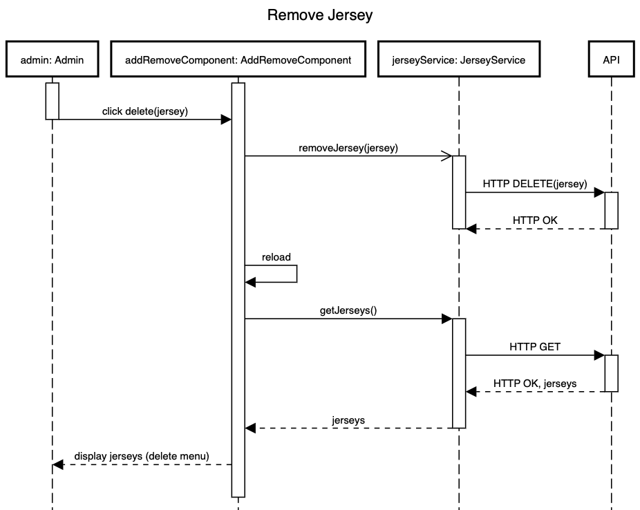

The shopping-cart component is also responsible for the user checkout. The user may click a displayed "checkout" button to check out. The total price of all jerseys in the cart is presented to the user and the shopping cart is cleared.

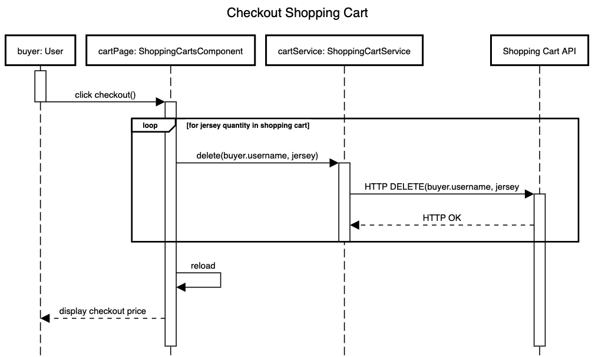

A component available to only the admin is the add-remove-from-store-page. The admin can create new jerseys and that will then be add to the inventory.json file. It will also be available to view in the browse page. The admin can also delete a jersey from the store. This will remove the jersey from the inventory.json file.

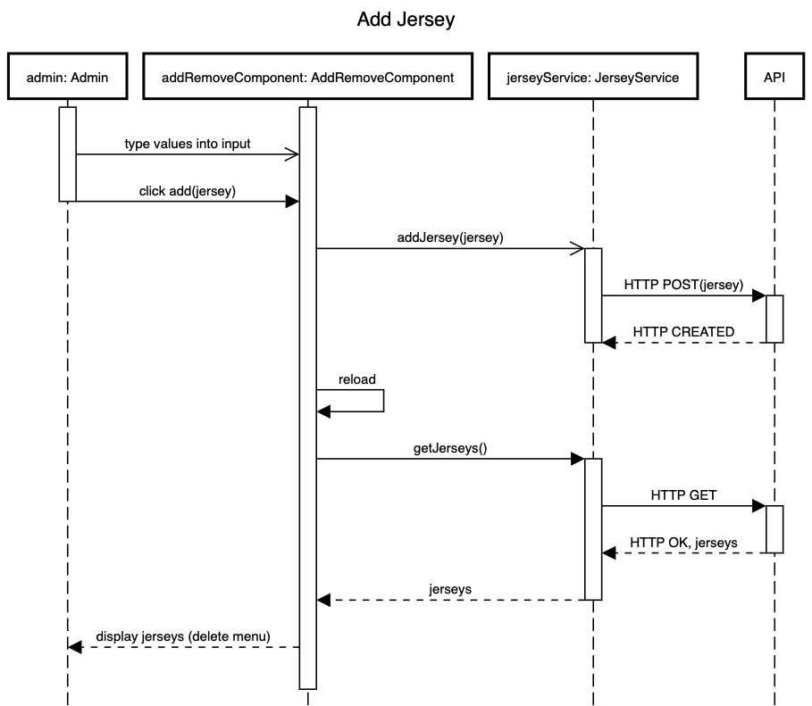

Finally the logout is the final component. If the user clicks logout, then they will be directed to the login page. All changes the user made are saved.

### ViewModel Tier

In terms of controllers we have the InventoryController and ShoppingCartController. The services we have are the JerseyService and ShoppingCartService. 

The InventoryController handles the REST API requests/CRUD operations for the Product resource. 
The JerseyService takes in the URL, headers, and body from the InventoryController. It provides access to CRUD methods for the estore UI.
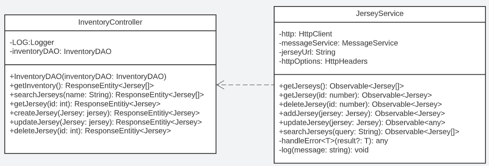

The ShoppingCartController handles the REST API requests/CRUD operations for the products in the shopping cart. 
The ShoppingCartService takes in the URL, headers, and body from the ShoppingCartController. It provides access to CRUD methods for the shopping carts in the UI.
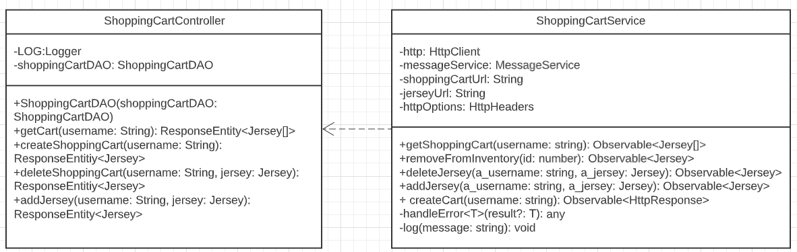

### Model Tier
A model available to both the user and the admin is the Jersey Model. It is used in every component
of our project to store all the necessary information for each jersey. The user and admin see a 
brief overview of the jersey information upon logging in. The admin can then add, remove and modify 
the information for each jersey through the respective components. The user can view all the available 
information for each jersey upon visiting the jersey detail component.

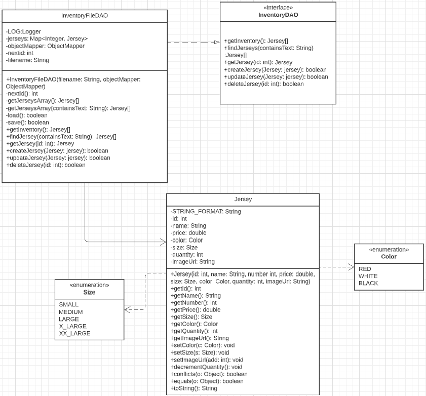

A model available to only the user is the Shopping Cart Model and can be viewed through the shopping 
cart component. It stores jersey models for each individual user so that users are able to purcahse 
jerseys. The user is able to add a jersey model to the shopping cart model through the browse and jersey 
detail components. The user can see what jersey models they have in their shopping cart model and remove 
jerseys through the shopping cart component.

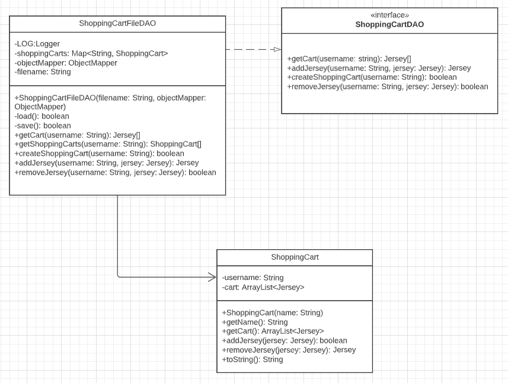

### Static Code Analysis/Design Improvements

#### Static Code Analysis

In the estore-api, our rating are as follows: Reliability - D, Security - A, Security Review - A, and Maintainability - A. 

The reason for our low score in Reliability is due to 3 bugs. 1 is minor, 2 are critical. 
1 of the bugs is that we must implement a hashCode() method. The other 2 critical bugs state that we shouldn't compare primitive values with null.
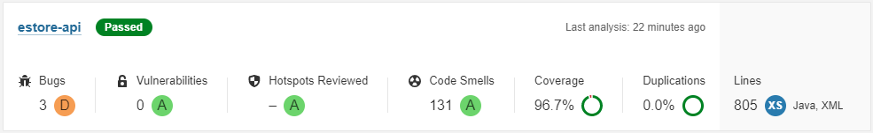

There are 131 code smells, however our Maintainability still has a good rating. Most code smells are minor, and don't impact functionality.
They're mainly refering to adhering to neatness and readability concepts. For example, in our InventoryFileDAO.java, we need to reorder modifiers to comply with the Java Language Specification. Our nextId() method was flagged because it is private, static, and syncronized. This means that the method should the last method in the class. This doesn't impact functionality, but it impacts readability because developers usually adhere to the standard order. If we have new members joining the project, it would be helpful to properly reorder the methods in each of our files. For reference, the standard order is as follows: Annotations, public, protected, private, abstract, static, final, transient, volatile, synchronized, native, default, and strictfp. 
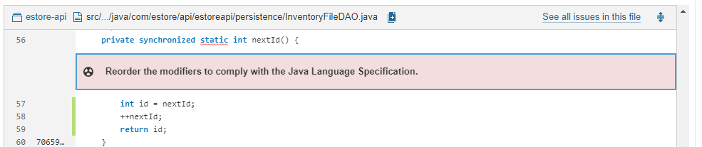

In the estore-app, our ratings are as follows: Reliability - C, Security - A, and Security Review - A, and Maintainability - A. 

The reason for our low score in Reliability is due to 4 bugs, all of which are major and are for the same reason (just in different locations). 
The problem is there's an unexpected missing generic font.
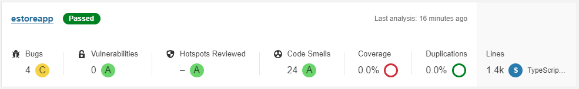

There are 24 code smells, however our Maintainability still has a good rating. Most code smells are minor, and don't impact functionality.
Again, they're mainly refering to adhering to neatness and readability concepts. For example, in our login.component.ts, we need to remove the unused import of 'Input'. There isn't a reason to import modules that are never used. This pointlessly increases the load, impacting our performance. This could be chalked up to initially using that module, but later not needing it. We should pay more attention to detail so this doesn't happen in the future.
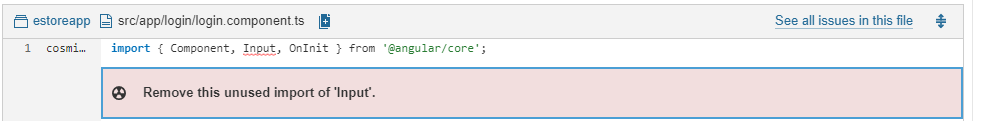

**Feature Improvements**

In the estore-api, the hashCode bug is in Jersey.java (line 120) and the 2 null assertion bugs are in ShoppingCartFileDAOTest.java (lines 166 and 178).

In Jersey.java, since we overrode  "equals()" we must override “hashCode()” because of the of the contract between equals(Object) and
hashCode().
The contract states:
If 2 objects are deemed equal by "equals(),"  then using "hashCode()" with those two objects should produce the same integer.
To comply with the contract, we need to override both "equals()" and "hashCode()" (as stated before).
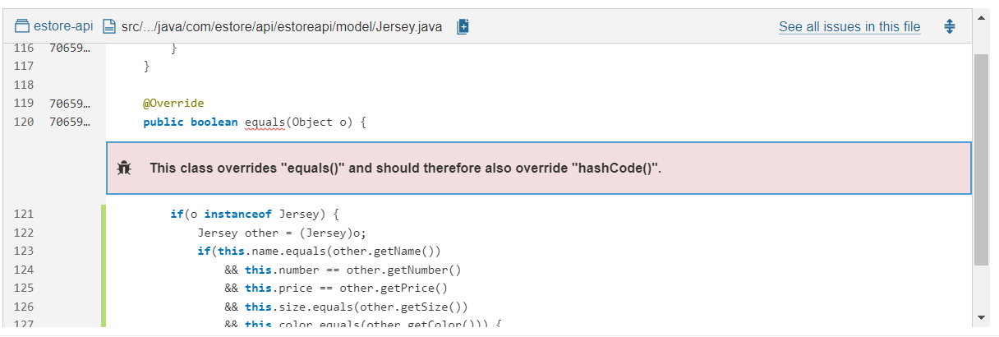
The solution to this bug is simple. We just need to implement a "hashCode()" method that returns the same integer when identical Jerseys are passed through. Using the "hashCode()" method could be helpful if we implement a data structure such as a hashtable in the future.

In the ShoppingCartDAOFileTest.java, we shouldn't assert if a primitive value is null. We assert if a boolean value is null, which doesn't make sense. If we are comparing incompatible types, it will always fail, and negative assertions will always pass.

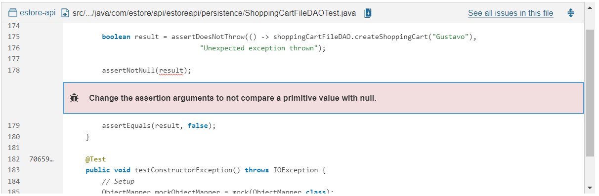
In order to fix this bug, we just need to get rid of lines 166 and 178 in ShoppingCartFileDAOTest.java. No matter what, the boolean value will be either true or false. It will never be null.

In the estore-app, the font bugs are in src/styles.css at lines 195, 205, 215, and 225. 
If none of the fonts declared are available on the browser, the default font of the browser is displayed. When font-family is declared, it's only either 'Rockwell' or 'Impact'. Those are not generic font families.

To fix the font bug in the estore-app, the solution is straightforward. We need to define a generic font family each time we declare the font.
We need to add a generic font family when we declare the font-family. The generic font families are: Serif, Sans-serif, cursive, fantasy, and Monospace. Doing this would ensure that our UI would present optimally on any system, including one that does not have our favored font, rather than just resorting to a default that does not work well with our page.

The recommendations from the angular report speak to a larger theme of ensuring that our product runs optimally on all systems. In addition to the font specification, we should adopt a philosophy of ensuring that what we write should run well on any system we want to run our product on, not just that with which we test it. Obviously, we cannot ensure that our product will run on everything, but the angular report reminds us that we should do our best to review and look for any glaring aspects that will only work in some places. For future developments, we should make sure we use elements, styles, architectures, etc. that are available on all systems that we want our product to work with.

More performance-based improvements are discussed in the design analysis below

#### Design Analysis

There are several areas of our project that have a close connection with major object-oriented design principles. We have identified three areas of interest in our implementation (not from the instructor-given architecture) that would require close focus in an ongoing project. In each area there are design principles that have been followed very well and ones that need to be improved on.

**Low Coupling with the Jersey Model:**

The extent to which our Jersey class adheres to the low coupling principle was shown through the addition of fields to the class at two separate points across the project. When we added a quantity attribute to the Jersey class, we only had to modify implementations inside helper methods in the jersey class to ensure that external functionality did not change. Because other classes like the InventoryFileDAO interacted with the Jersey class by using helper methods, the exact implementation of those methods (if we wanted to have quantity be a factor in equals(), for instance) did not require external classes to have any knowledge of the change within Jersey. This illustrates Jersey's good use of low coupling because (for instance) InventoryFileDAO's functionality does not depend on changes within Jersey, and changing Jersey did not have a high impact on any other class.

One place where the coupling between our jersey model casued a problem with code functionality after adding a field was in the shopping cart persistence storage. Unlike the above example, jerseys are stored in full in the shopping carts, so when the quantity attribute was added to the Jersey class, it became necessary for the shopping cart storage to know that it existed to properly store the jerseys in the cart. This caused an issue in the serialization process when we first implemented it, with jerseys added without a quantity attribute not removing themselves when their supposed quantity reached 0. If we had a single place where could store Jersey information (as opposed to 2 places, inventory and shopping carts), we could then only store references to the fully stored jerseys in places where jerseys needed to be stored. If the shopping cart persistence only stored jersey identification values instead of all information, this would loosen the coupling between the two classes and make changes to the Jersey implementation itself have little to no effect on the shopping cart or future classes that needed to store jerseys. 

Another potential helper to reducing coupling with the Jersey model is using a database instead of json files (discussed below).

**User Front-end Model:**

A place within our front end that adheres particularly well a few design principles is how users are identified and stored. Rather than passing around a username string through our front-end components and needing to provide logic in all of them, we wrote a generic User class, which contains a username field and methods for determining if the user is an admin and retrieving the shopping cart. This adheres to the single responsibility principle because in separating the user logic from the component functions that require it, we eliminate the need to alter component classes to facilitate changes to user functionality. The component classes should not be responsible for both their page's interaction with the api and users and also user functionality. That would be 2 responsibilities.

Although our front-end user design functions well, we could have taken better advantage of polymorphism and created buyer and admin child classes of User to better adhere to the open/closed principle. Because we use User to represent both admins and buyers, we want to leave it open to more functionality and the possible representation of different types of users in the future. However, because different functionality can belong to specific user types, we should have separated the admin-specific and buyer-specific functionality to child classes, while leaving the base functionality that applies to all users in the User parent class. This would have left User open to extension, as child classes could define their own specific behavior and use the universal user behavior, but closed to modification, as no child would need to modify the base functionality. Unfortunately, changes to buyer- or admin-specific functionality currently require modifying the User class (not just adding to it). 

**Better Design with a Database DAO**

A specific improvement to our design that would improve the performance, capabilities, and design of the system is to replace the json file persistence storage with a database. 

If we were able to set up a database to store the store data, we would write a database Data Access Object for the inventory and shopping carts that implements the methods in our DAO interfaces. Our current back-end design adheres to the dependency inversion principle by having both controller classes and persistence access depend on DAO interfaces rather than concrete implementations. Because of this, we could simply inject a database DAO into the controller rather than a file DAO, making the new system design easy to implement.

The addition of a database would also further decrease the coupling in our system. Rather than fully deserializing and serializing all objects in our storage, we would be able to retrieve and write to specific fields in the database using SQL or another similar language. Not only would this improvement decrease the time complexity of persistence operations, it would make the data access operations unaffected by changes in the definition of objects in the model. In the example from above, adding fields to the Jersey class would not have negative impacts on the functionality of the insertion and retrieval from the data storage if a database was used, provided we wrote a good database access object. We would, of course, have to modify database schema and the CRUD operations if we wanted to factor in additions to model classes, but that would have to be done no matter what. 

## Testing
### Acceptance Testing
Currently, all 22 user stories from the first 3 sprints have passed all acceptance criteria tests, and no stories have any failing criteria. All 8 user stories from the 4th sprint have not had their acceptance criteria implemented and tested as well, although these criteria were mostly related to the completion of the design documentation or improvements to the UI, and therefore not able to be objectively analyzed. All issues found during previous acceptance test iterations were found, fixed, and re-tested until their criteria passed.

Previous issues found during acceptance testing include items returning to the inventory after being checked out for purchase, update fields not taking input properly, and the checkout button not functioning. All were debugged and fixed during our acceptance testing process before the branch that sourced the error was pushed to the main.

A couple of acceptance criteria failures were caused by element boxes defined by the CSS overlapping and covering input fields or buttons. While there are no current issues, future improvements to the design of our pages could cause this issue to reappear, which would necessitate an acceptance testing review. Careful testing of the full front-end would be required after future improvements to ensure no new errors crop up.

### Unit Testing and Code Coverage
Unit testing is done on a class-by-class basis. Each non-enum class in the view-model and model tiers has its own unit testing class that provides unit tests that cover all of its aspects. Mock objects and classes are used when testing any DAO or controller class to avoid running our full project while testing and to ensure adherance to dependency inversion.

The current code coverage acheived by our unit tests is 98% of all instructions (individual lines) and 90% of all branches (possible paths through the code). Our code coverage target is 90% across the board. Although the 95% area would be more ideal, it is impossible to test certain paths through our code due to the proper use of encapsulation and data hiding within our classes being tested, i.e. our test classes would have to edit class fields or private methods in order to test certain branches. Because we have to account for certain impossibilites, we decided that 90% is a good goal to have.